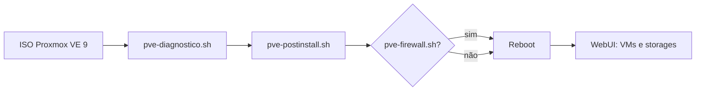

# Manual do projeto — Proxmox VE 9 (homelab)

Repositório: [github.com/VIPs-com/proxmox-ve9-scripts](https://github.com/VIPs-com/proxmox-ve9-scripts)

Este manual descreve **o que o repositório é**, **o que cada script faz** e **como usar** em 2026, com Proxmox VE 9.x sobre Debian 13 Trixie.

---

## 1. O que é este repositório?

**Não é** um instalador do Proxmox nem um criador automático de cluster.

É um conjunto de scripts Bash para:

1. **Diagnosticar** um host já instalado (rede, serviços, discos).
2. **Pós-instalar** (repos, NTP, upgrades, opções de segurança).
3. **Configurar firewall** do Proxmox via arquivos `host.fw` / `cluster.fw` (opcional).

O caso de uso principal é **um servidor standalone** (um único nó). O modo **cluster** existe para o futuro, com **3 ou mais nós** — cluster de 2 nós perde quórum Corosync quando um host cai.

---

## 2. Estrutura de arquivos

```
scripts/
  pve-postinstall.sh    # Pós-instalação (principal)
  pve-firewall.sh       # Firewall Proxmox (opcional)
utils/
  pve-diagnostico.sh    # Diagnóstico completo
etc/
  pve-postinstall.conf              # Exemplo standalone
  pve-postinstall.standalone.conf   # Template para download automático
  pve-postinstall.cluster.conf.example
  pve-firewall.conf.example
docs/
  MANUAL.md             # Este arquivo
```

---

## 3. Scripts em detalhe

### 3.1 `utils/pve-diagnostico.sh`

**Para que serve:** gerar um relatório no terminal (e em `/tmp/pve-diagnostico_HOSTNAME_DATA.log`) do estado atual do nó.

**O que verifica:**

| Bloco | Conteúdo |
|-------|----------|
| Internet | Gateway (rota default), ping 8.8.8.8 |
| DNS | Resolução direta, PTR reverso do IP do host |
| Rede | `ip a`, `ip r` (interfaces e rotas) |
| Firewall | `iptables`, `ip6tables`, `pve-firewall compile` |
| Cluster | **Só se** `pvecm status` funcionar: ping e portas 22, 8006, 5404, 5405 entre nós |
| Serviços | `pvedaemon`, `pvestatd`, `pveproxy`; em cluster também `corosync`, `pve-cluster` |
| Discos | `lsblk`, SMART (`smartctl`), `zpool status` se houver ZFS |
| Recursos | `free -h`, `uptime` |
| Logs | `journalctl` (erros) e `dmesg` (warn/err) |

**Quando rodar:** antes do pós-instalação, após mudanças de rede/firewall, ou quando algo “não responde”.

**Não altera** o sistema (somente leitura, exceto sugerir `apt install` se faltar `dig`).

```bash
bash utils/pve-diagnostico.sh
# ou
bash <(curl -s https://raw.githubusercontent.com/VIPs-com/proxmox-ve9-scripts/main/utils/pve-diagnostico.sh)
```

---

### 3.2 `scripts/pve-postinstall.sh`

**Para que serve:** automatizar tarefas repetidas depois de instalar o Proxmox pela ISO ou upgrade para PVE 9.

**Modos:**

| Modo | Flag / config | Comportamento |
|------|----------------|---------------|
| `standalone` | padrão | Não exige lista de nós; não mexe em `/etc/hosts` de cluster |
| `cluster` | `--mode=cluster` + `CLUSTER_NODES_CONFIG` (≥3) | Configura `/etc/hosts`, valida IP do nó, testa ping entre pares |

**O que faz (em ordem):**

1. Carrega `/etc/pve-postinstall.conf` (ou baixa template standalone do GitHub).
2. Lock em `/etc/pve-postinstall.lock` (evita rodar duas vezes; use `--skip-lock` só em teste).
3. Verifica `curl`, `ping`, `nc`.
4. **Cluster:** valida 3+ nós, rede, hostname/IP na lista; configura `/etc/hosts`.
5. Testa internet/DNS.
6. Exige Proxmox VE **9.x** (alerta se versão maior).
7. Avisa se RAM &lt; 4 GB.
8. Configura **timezone** e **NTP** (`timedatectl`, fallback `ntpdate`).
9. Desabilita repo **enterprise**, habilita **no-subscription** + Debian **trixie**.
10. `apt update`, `dist-upgrade`, `autoremove`, `clean`.
11. Remove aviso de assinatura na WebUI (hook `proxmox-widget-toolkit`) — sem licença paga.
12. Pergunta: **hardening SSH** (root só com chave, sem senha).
13. Pergunta: pacotes extras (`qemu-guest-agent`, `htop`, etc.).
14. Verifica serviços (`pvedaemon`, `pveproxy`; em cluster + corosync).
15. **Cluster:** ping entre nós.
16. Limpa logs antigos `pve-postinstall-*.log`.
17. Pergunta: **reboot**.

**O que NÃO faz:**

- Não cria cluster na WebUI (você faz Create/Join manualmente).
- Não configura firewall (use `pve-firewall.sh`).
- Não instala Ceph automaticamente.

**Configuração no host:**

```bash
cp etc/pve-postinstall.conf /etc/pve-postinstall.conf
nano /etc/pve-postinstall.conf
bash scripts/pve-postinstall.sh
```

**Cluster (futuro):**

```bash
cp etc/pve-postinstall.cluster.conf.example /etc/pve-postinstall.conf
# edite 3 IPs/hostnames
bash scripts/pve-postinstall.sh --mode=cluster
```

---

### 3.3 `scripts/pve-firewall.sh`

**Para que serve:** aplicar regras no firewall integrado do Proxmox (não substitui firewall da rede/LAN).

**O que faz:**

1. Backup de `host.fw` e `cluster.fw`.
2. Cria IPSet `local_networks` com redes de `LOCAL_NETWORKS`.
3. Regras IN no host: SSH 22, WebUI 8006, NTP, ICMP, tráfego de cluster na `CLUSTER_NETWORK` (Corosync UDP 5404-5405, pve-cluster TCP 2224).
4. `pve-firewall compile` e `reload`.
5. Lock em `/etc/pve-firewall.lock`.

**Quando usar:** depois do `pve-postinstall.sh`, em cada nó. Em **standalone**, regras de cluster na rede interna costumam ser inofensivas se a rede estiver correta.

```bash
cp etc/pve-firewall.conf.example /etc/pve-firewall.conf
nano /etc/pve-firewall.conf
bash scripts/pve-firewall.sh
```

---

## 4. Fluxo recomendado (standalone)



1. Instale Proxmox VE 9 pela ISO oficial.
2. Instale dependências: `apt install -y curl wget iproute2 dnsutils iputils-ping netcat-openbsd smartmontools zfsutils-linux`
3. Diagnóstico → Pós-instalação → (opcional) Firewall → Reinício.
4. Crie VMs/CTs na interface web.

---

## 5. Cluster opcional (3 nós)

**Por que 3?** Corosync precisa de **quórum**. Com 2 nós, se um desliga, o outro fica sem maioria de votos — comportamento que você viu no lab Aurora/Luna.

**Passos:**

1. Prepare os 3 hosts com IPs fixos e hostnames únicos.
2. Em cada um: `/etc/pve-postinstall.conf` em modo `cluster` e `pve-postinstall.sh --mode=cluster`.
3. No **primeiro** nó: WebUI → Datacenter → Cluster → **Create**.
4. Nos outros: **Join** com informações do primeiro nó.
5. `pve-firewall.sh` em todos (mesma `CLUSTER_NETWORK`).
6. `pve-diagnostico.sh` em cada nó para validar portas 5404/5405/2224.

Alternativa com 2 hosts físicos: **QDevice** (terceiro voto leve) — não está automatizado neste repo.

---

## 6. Arquivos de configuração

| Arquivo no host | Variáveis principais |
|-----------------|----------------------|
| `/etc/pve-postinstall.conf` | `PVE_MODE`, `TIMEZONE`, `DEBIAN_CODENAME`, `CLUSTER_NETWORK`, `CLUSTER_NODES_CONFIG` |
| `/etc/pve-firewall.conf` | `CLUSTER_NETWORK`, `LOCAL_NETWORKS` |

Logs:

- `/var/log/pve-postinstall-*.log`
- `/var/log/pve-firewall-*.log`
- `/tmp/pve-diagnostico_*.log`

---

## 7. Legado removido (PVE 8 / Aurora-Luna)

Não mantemos mais:

- `proxmox-postinstall-aurora-luna.sh`
- `_old_README.md`, `guide/`, `basico_diagnostico-proxmox.sh`
- Referências a Debian **bookworm** e cluster fixo de **2 nós**

Se você tinha bookmarks `curl` antigos, atualize para os caminhos `pve-*` deste manual.

---

## 8. Publicar no GitHub

Após `git push`, a descrição do repositório no GitHub deve refletir PVE 9, por exemplo:

> Scripts de diagnóstico e pós-instalação para Proxmox VE 9.x (Debian 13) — standalone por padrão, cluster opcional com 3+ nós.

O repositório no GitHub foi renomeado para **proxmox-ve9-scripts**; links antigos `proxmox-scripts` redirecionam por um tempo.

---

## 9. Referências

- [Proxmox VE 9.0 release](https://forum.proxmox.com/threads/proxmox-virtual-environment-9-0-released.169258/)
- [Install on Debian 13 Trixie](https://pve.proxmox.com/wiki/Install_Proxmox_VE_on_Debian_13_Trixie)
